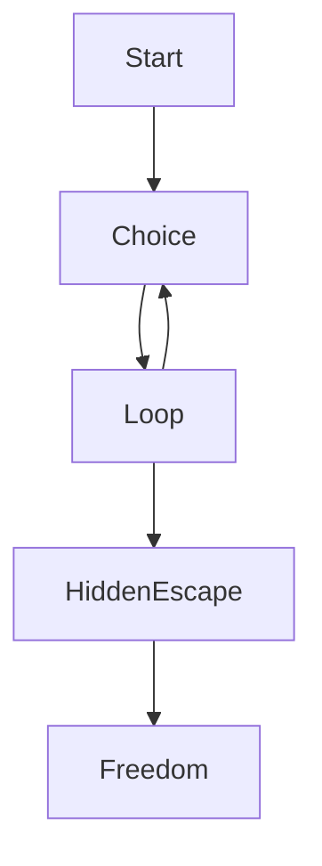

# 🔄 Loop Trap (Infinite Decision Paradox) 🧠


---

## 🧠 Project Overview

🔄 **Loop Trap** is not just a game… it’s a psychological experience.

You are given choices —
but every choice leads you back to the same place.

👉 Or does it…?

---

## 🎮 Experience

👁️ You see two doors
🚪 You choose one
🔁 You return again

The loop continues…
until you realize something is **hidden**.

---

## 🚀 Features

✨ 🔁 Infinite Decision Loop
✨ ⚡ Glitch Effects (Reality Breaking)
✨ 🧠 Psychological Narrative
✨ 👁️ Hidden Escape Mechanism
✨ 🎭 Minimal but Deep UI

---

## 🎯 Core Concept



---

## 🧩 What Makes It Unique

| 🔍 Element    | 💡 Meaning              |
| ------------- | ----------------------- |
| Loop          | Illusion of control     |
| Repetition    | Human behavior patterns |
| Hidden Button | Awareness / realization |
| Glitch Effect | Breaking reality        |

---

## 🛠️ Tech Stack

| 💻 Tech    | 🔧 Role                  |
| ---------- | ------------------------ |
| HTML       | Structure                |
| CSS        | Styling + Glitch Effects |
| JavaScript | Logic + Loop System      |

---

## 📂 How to Run

```bash id="v3l9k2"
1. Copy the code  
2. Save as looptrap.html  
3. Open in browser  
4. Try to escape… 😈
```

---

## 🧠 Hidden Insight

> You were never stuck because of the system…
> You were stuck because you didn’t look deeper.

---

## 🔥 Future Enhancements

🚀 Add sound effects (whispers, glitches) 🔊
🚀 Add multiple hidden escape paths 🔐
🚀 Add cursor tracking (creepy AI feel) 👁️
🚀 Add story mode with psychological twists 📖
🚀 Add timer pressure ⏳

---

## 👨‍💻 Author

💡 Created by: **Yashu**
🎯 Project Type: Conceptual / Psychological Web Experience

---

## ⭐ Support

If this made you think:
🌟 Star it
📢 Share it
💬 Discuss the concept

---

## 🧠 Final Thought

> “The hardest trap to escape…
> is the one you don’t realize you’re in.” 🔄

---
